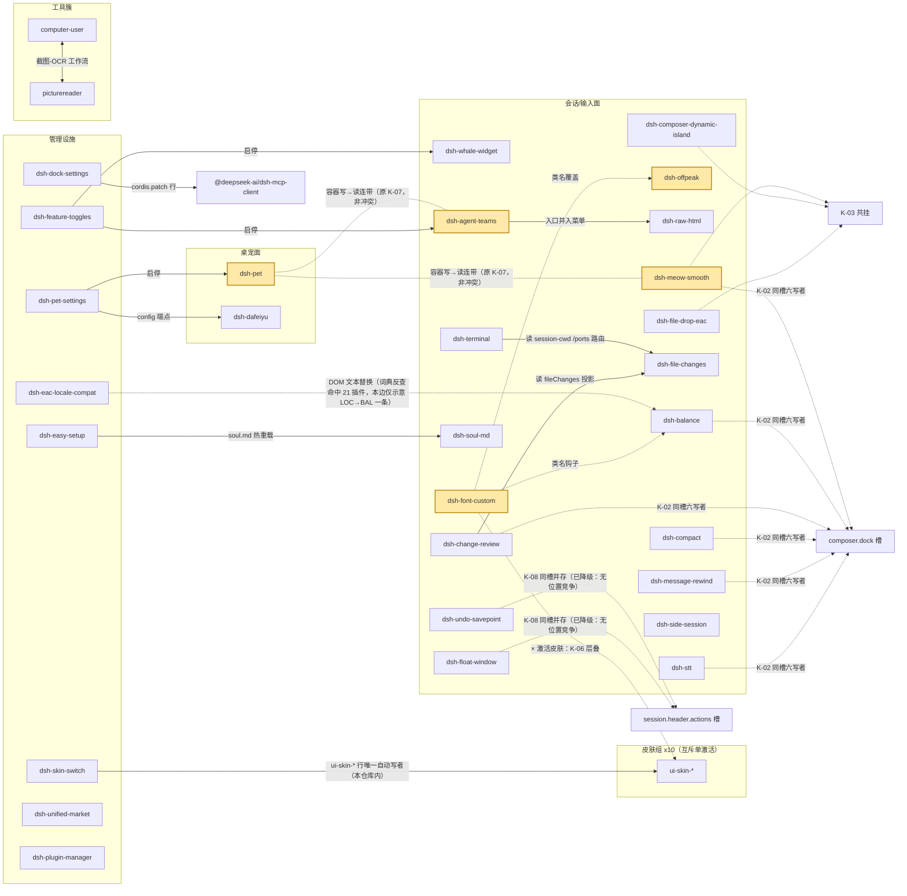

# 插件标签、修改范围与冲突审计 v2（Task 2.2）

Closes #366

> 基线 dev@`e46ebb2`。对象：49 插件（主表）+ 10 皮肤（cordis 插件包，参与冲突判定、不参与功能打标，图中折叠为组节点）+ 1 SDK（仅注记）。
>
> 纪律：**关键结论类计数**带 `数字@revision@平台@规则`（四段，缺任一不得作结论——"49 vs 47"之争即平台段缺失所致）；行内零散计数以就近注明的口径为准；负面结论附命令；证据分档 code＞test＞comment＞external；内核内部行为一律 not-tested；未核实处行内标注【人工】。
>
> **数据来源**：原始数据继承自项目既有资料——团队治理规范 `.agents/skills/deepseek-harness-eac-dev/references/`（17 篇，**已随仓库跟踪、外部可查**）与 `docs/HANDOFF-2026-09-14-TASK22.md`（Task 2.2 定稿 v2.1 的讨论总结，**本地未跟踪文件、不随 PR 提交**）。**本文档出现的计数与锚点均已按 `dev@e46ebb2` 源码复现**（命令见附录A），继承项与复现结果的差异均已在行内标注。因 `HANDOFF` 外部读者无法打开，**凡需追溯处请以本文档给出的代码锚点为准**，勿以该本地文件为据。文中 review 意见引文均出自 [PR #388 评论区](https://github.com/DSH-EAC/DSH-Desktop-EAC/pull/388)（GitHub），不随仓库分发。
>
> **快照性质与迁移提示**：本表是 **`dev@e46ebb2` 时点的静态快照，不是长期有效结论**。v6 重构中直接触及本表对象的有（均据 `docs/adr/0005-builtin-shell-skin-pack.md`）：① **Task 1.2「AIO 视觉拆解」**——该 ADR 载明"`assets/skins/` 下的 10 款皮肤是完整 cordis 插件包，**属 Task 1.2 的拆解对象**"（`:24-25`），故 **§2 皮肤组节点与 §3 皮肤写者（K-03 / K-06）的对象构成会变**；② **Task 3.1「最简本体」**（目标"最简本体只保留对 dsh 的最简包装"，`:16-17`）——该 ADR 载明 **Task 1.2 / Task 3.2「皮肤包接入最简本体」/ Task 6.2「外部样式包」三者同以 Task 1.1 为可挂接接缝**（`:17-19`；该句为"本体 UI 先做到结构归本体、视觉归皮肤包，后续 Task 1.2、3.2、6.2 才有可挂接的接缝"），上述任务落地会改变"本体侧 / 插件侧"的分界、并可能引入本表未收录的包形态。故 **v6 迁移落地后，§2 / §3 / §7 的清单类结论需按新 revision 重跑**；**§0 判据与口径、附录A 的可复现命令，以及《PHASE2-词表卡与扫描器规格》的判定方法均可复用**。
>
> **范围边界（显式声明）**：本审计对象为 `dsh-desktop/assets/` 下的 **`plugins/`（49）+ `skins/`（10 款，另有 1 份 `dsh-skins-LICENSE.txt` 非皮肤）+ `sdk-plugins/`（1，仅注记）**。**不在范围**（显式列出，免被读作遗漏）：同级 `agent-presets/`（10 个预设目录）与 `skills/`（1 个技能目录 + 1 份 `README.md`）——**形态非插件**；以及 **`shell-skin/`**——ADR 0005 / Task 1.1 随 #386 于 2026-09-14 新增，本快照时点（`e46ebb2`，2026-09-12）该目录**尚不存在**，而本表提交叠加于 Task 1.1 合入之后，故**工作区已含 `shell-skin/eac-default` 而本表未覆盖**，此为**快照时点所致、非遗漏**。两类"皮肤"的归属 ADR 0005 已作界定：`assets/skins/` 是"**dsh 客户端 cordis 皮肤目录**"（由 `companion-sync.ts` 枚举并注入 profile），`shell-skin/` 为"**壳层皮肤**"（不参与该协议，经 `/skin/<file>` 静态路由伺服），ADR 明示二者**同名但字段集、目录、消费方均不同**，混放会混淆归属（`:39-41`、`:68-69`）；本表按该界定**只覆盖前者**，不预设 Task 1.2 / 3.2 的拆解结论。
>
> **SDK 注记（兑现"仅注记"）**：`sdk-plugins/` 下仅 1 件——`sample-sdk-plugin`（`package.json` 自述"**VNext Phase 2 SDK V1 示例插件**"，`index.js` 头注标注 Task 11.3），运行于**独立 Extension Host 进程**（Job Object 围栏）、零侵入 Core Profile，演示 `registerTool` / `provideContext` / `settings` / `on('turn-end')` / `log` 五类能力。**性质为示例件、非产品功能**，故不参与冲突判定与功能打标，仅在此注记。
>
> **版本沿革与范围变更**：本版按 PR review 意见重整结构（① 按**功能**打 category tag、② 只查**插件之间**、③ 表只描述修改范围、④ mermaid 依赖图）。相对上一版（git 历史 `e26365c`），**移出的内容分两类**：
>
> - ① **已由 §6 出圈指针承接、不在 issue #366 三要求内**——宿主 z-index 越界 + 插件侧 19 处台账、发行侧（descriptor 违例 / 单实例键 / taskkill / COEX）、装配链护栏（原 C-01/05/10/11）、安装期预检器 7 码、插件写死内核哈希（原 C-08）、纠正墓碑。
> - ② **在题内，但本期改了视角或未做**（**如实交代，非遗漏宣称**）——插件间**耦合型冲突 3 条**（原 C-02 共享依赖分裂 / C-06 层级抢共用容器 / C-09 跨插件类名耦合，去向见 §3 新增的范围声明）、分类**四维**（D1 治理归属 / D2 来源可信度 / D3 加载通道 / D4 公用资源占用）、**交叉索引**（60 行 × C/F 双列，实测 53 表格行）、**功能影响表 F-01..F-42**（42 数据行，视角为"用户可见症状"——本版改以 §7「禁用连带」呈现，交底见 §7.3）、**覆盖登记表**（`HANDOFF-2026-09-14-TASK22.md` 约定的"覆盖数字另立一表、不进冲突计数"——本版未恢复该表，其数字散见：§0 皮肤侧结构事实 / §2 统计行（lite 停 14、核心锁定 10）/ §3 K-06（alias 覆盖数值）/ §6（路由与 z-index 台账计数））。
>
> 完整旧版可查：`git show e26365c:docs/PLUGIN-CONFLICT-AUDIT.md`（该 commit 已在 `origin/dev` 上；若 PR 经 squash 合并致上游历史不可达，改看 [fork 上的永久链接](https://github.com/ViscaOwO/DSH-Desktop-EAC/blob/e26365c/docs/PLUGIN-CONFLICT-AUDIT.md)）。本文各处「git 历史 `e26365c`」指针均适用本说明。

## 0. 判定口径（三步 + 「同点」判据）

1. 功能 tag 定"它是什么"（§2 tags 列，只承载功能轴）；
2. 修改面定"它动哪里"（§2 修改面列，R=只读 / W=写 / RW=两者）；
3. 读写互判：**W×W 同修改点 = 冲突**（§3）；W×R = 依赖（§4 图）；R×R 不登记。

**四元组与「同点」判据**（v2 明确定义，替代此前"仅锚点相同即同点"的隐含口径）：

- **锚点** = 注册槽名 / DOM 选择器 / CSS 变量名（比对前规范化：转义反斜杠与引号差异不计）；
- **动作** = ① 注册（`slots.register` / `tools.register` / `webServer.register`）② CSS 声明（属性:值）③ DOM/数据写（dataset / setAttribute / 派发事件）；
- **归一化值** = 动作的目标值（注册的 `order` / CSS 属性值 / 写入键值）；比对去空白，`!important` 视为声明修饰、不入归一化；
- **同点** = ①**同一宿主侧装配目标**（同一渲染文档 / 同一槽注册表 / 同一 CSS 层叠域）②锚点 ③动作 三项全中，且满足任一：**甲** 注册标识（`id`/`key`）相同；**乙** 同一**共享位置空间**的排布轴上 `order` 同值或相邻（差 ≤1）；**丙** 同一锚点的同一 CSS 属性/变量被 ≥2 方声明；
- **① 释义**：49 插件各占独立目录、各有独立入口文件，**跨插件不存在同一物理文件被两方写入**（已实测：25 份 `cordis.patch.yml` 均为往装配层 `insert` 各自互异的行 id，非共享文件）。故 ① 取"装配目标"义；若按字面"同一文件"读，本判据对跨插件场景恒假，与 §3 已判四条冲突自相矛盾。
- **不算同点**（改列 §3 降级登记）：① 属性面不同（一方布局、一方外观）；② 标识相异且无位置竞争 =「同槽并存」；③ W×R（按第 3 步归依赖）。

**W / R / RW 判据**：产生新声明实例或新注册 = W；仅查询/消费既有声明或数据 = R；兼有 = RW。

**「共享位置空间」的界定**（决定「乙」是否适用；属**人工判定**）：写者渲染为**同一位置空间里并列的元素**（按钮行 / 芯片行 / 动作条）→ 适用「乙」；写者渲染为**各自独立的卡片或段落**（设置卡、系统提示段）→ 不适用，其 `order` 只决定排序先后、不产生位置争夺。按此口径：`composer.dock`、`conversation.input.right`、`session.header.actions` 适用；`settings.section`（实测 6 组同值 order：23/24/29/30/50/80）、`settings.plugins.tab`（4 条 / 3 插件：unified-market 两条 order 5+6、skin-switch 15、plugin-manager 20）、`settings.general.item`（conversation-tweaks `quiet-output` order 25 × undo-savepoint `undo-keys` order 30）、`settings.plugin.item`（compact order 28 × dafeiyu order 30，**二者均带 `key` 字段**、keyed 天然隔离）、`systemPrompt.section`（order 117 同值：agent-teams × undo-savepoint）**不适用**，其同值 order 不立表。**后四者一并列入本名单 = 已排查且判定不立表**（与"未排查"相区分；全库多写者共享槽共 10 个，与本名单 + §3 立表 + 降级登记合并后无遗漏）。该界定为**作者侧推定、可否决**（§5）。

皮肤↔皮肤不入冲突表（skin-switch 的单激活**非结构性保证**——仅 apply/reset 时改写 `disabled:true`，`list()` 对多激活静默取首，故该豁免属约定性）；皮肤↔插件仍入表（K-03/K-06 的皮肤写者依此）；"皮肤入冲突口径"整体为**作者侧推定、可否决**（§5 ②，与上文「共享位置空间」界定同属推定层，非"待裁决"项），若否决则 K-06 出表、K-03 去皮肤写者。

**皮肤侧结构事实（逐款扫描 10 款实测）**：10 款中 **8 款创建 `position:fixed` 装饰层**（`document.createElement` 动态挂载，元素经 `dataset.skinChrome` 写标记、渲染为 `data-skin-chrome` 属性）——dragon-heir `backdrop`（全屏背景层）、minecraft `stage`/`scrim`（0）、maid-atelier `top-trim`/`bottom-trim`/`character-stage`（20/19/0）、miku·qq98·ths·xp 各 `titlebar`+`statusbar`、trading 另加 `tape`（**此五款全文 z-index 唯一值均为 100**）；**blue-fantasy 与 whale-song 不创建**（无 `skinChrome` 标记）。皮肤**不注册任何槽**（`slots.inject|register` 在皮肤侧 0 命中），故除 §3 已登记项外不新增冲突。其中"多款 titlebar/statusbar 统一 z-index:100"是单激活豁免**属约定性而非结构性**的实证（一旦同时激活必撞；皮肤彼此独立实现却取值趋同，与 K-06 的 alias 计数趋同同类）。另：maid-atelier `top-trim` 的 z-index 20 与宿主 `shell.overlay` 容器同值（据 pet `lib/client.js:56` 注释披露），属**皮肤×宿主**、按本节口径整体推 §6，不立表。宿主自身越界与发行侧出冲突口径，指针见 §6。

## 1. 词表

**功能 tag（11 词，多选，主 tag 置首；开放扩展，增词走 PR）**

| tag | 判定问题 | tag | 判定问题 |
|---|---|---|---|
| ui | 它的**主要产出**是界面吗？ | billing | 它和钱有关吗？ |
| chat | 它作用于一条消息或一段对话吗？ | knowledge | 它注入的是规程/知识吗？ |
| tool | 模型因此能多做什么动作？ | automation | 它替用户自动触发什么？ |
| extension | 拆掉它，本体功能少了吗？（≠无冲突：dsh-pet 即反例） | management | 它管理的是插件/配置吗？ |
| theme | 换掉它，功能变吗？ | input | 它增强输入动作吗？ |
| notification | 它主动提醒用户吗？ | | |

> **`ui` 口径说明**：判定问题取"**主要产出**是界面"而非"是否涉及界面"。实测 49 行中 **21 个声明了 UI 面（settings-ui 等）却未标 `ui`**——作者侧一贯执行标准即"主业为界面"，本条修正使判据与主表一致。若按"是否涉及界面"读，`ui` 将覆盖 46/49 行并连带放大统计行全部计数，且失去 review 意见 1 所要求的"解耦时保留合适插件"的筛选力。

**与解耦的关系**（回应 [review 意见 1](https://github.com/DSH-EAC/DSH-Desktop-EAC/pull/388#discussion_r4023775566) 后半句"在后续解耦合时保留合适的插件"）：tag 轴同时承载**本体耦合深度**——`extension` 的判定问题问的是"拆掉它，本体功能少了吗"，答"不少"即为**解耦可去项**（dsh-pet / dsh-dafeiyu / dsh-phone / dsh-openclaw-bridge 一类）。`theme` **不构成可去判据**：`dsh-skin-switch` 是 `ui-skin-*` 激活行**在本仓库内的唯一自动写者**（`lib/index.js:59 SKIN_ROW_RE` / `:146` 匹配 `- id: ui-skin-*` 行 / `:206 writeFileSync`）——**"唯一"仅限于本仓库**：`dsh-plugin-manager` 经 `plugin-ops.ts` 的 `pluginManagerSetEnabled` 亦可写任意非核心行（含 `ui-skin-*`）；且"拆掉它是否导致 10 款皮肤全失活"取决于宿主对 home 层 `- insert:` 行的合成规则（home 行若丢失或被重同步，10 款反而全 insert→全开），该规则属**内核行为、not-tested**，故本行只断言"将失去集中式单激活切换能力"，**不断言失活**。`dsh-font-custom` 不属可去项：其 tags 为 `theme, ui`（**无 `extension`**），按本判据不成立——它与皮肤的关系是同名主题变量被**部分遮蔽**（§3 K-06），非功能可移除。其余 tag 表示该插件处在本体功能链上，解耦时需评估去向。注意 `extension` **不等于无冲突**（dsh-pet 即反例，其与 agent-teams 同槽注册，见 §3 降级登记 K-04）。**逐插件的层级归属与禁用连带另见 §7。**

**修改面（14 面）**：conversation-chat / composer-input / settings-ui / sidebar / overlay-floating / terminal / files / session-data / tools-agent / system-prompt / network-api / skins-theming / mcp-skills-config / backend-infra。每面判定 token 与可检测性见 **`docs/PHASE2-词表卡与扫描器规格.md`**（原附录A 词表卡，已迁出）。

## 2. 主表（49 行 = 功能 tag × 修改范围，一行一插件）

> **范围注（相对定稿 v2.1 的自我收窄）**：Task 2.2 定稿 v2.1 的**一期目标为 `category` 60 全量**（49 插件 + 10 皮肤 + 1 SDK）；本版为 **49 行插件 + 皮肤组节点（`SK`）+ SDK 仅注记**，**差 11 条**。理由：皮肤功能上全为 `theme` 且单激活互斥，逐款打标信息量为零，故折叠为组节点、仅在冲突判定（K-03/K-06）中作为写者出现。**"皮肤/SDK 是否要求逐款打标（补 10+1 行）"作为问题带给定稿方裁定。**

> **锚点口径**：行号 = **注册入口行 / 相关块首行**（非"值所在行"，偏移 ≤5 行不计）；`file` 为插件入口——**多数为 `lib/client.js`**，`dsh-stt` 为 `client/entry.js`、`dsh-offpeak` 为 `client/client.js`、host 侧为 `lib/index.js` / `lib/host.js`；行内已注明文件名者以注明为准。**裸 `:NNN` 写法**（部分行仅写行号不重复文件名）继承本行首个路径或按上句解析为该插件默认入口；含非默认入口的行（offpeak `client/client.js`、stt `client/entry.js`）均已显式写全路径，另有 `lib/` 前缀者一律写全。**未给 `file:line` 的行**：共 **18 行**：其中 **11 行给槽名**（`settings.section`×7 / `settings.general.item`×2 / `settings.plugin.item`×1 / `settings.plugins.tab`×1），另 **7 行给机制或 API 名**（`defineTool+assemble` / 全局 DOM 文本替换器 / 写 `soul.md` / 启停声明 / `sessionProjections`+API / 强制中文思考注入 / `cordis.patch.yml` 挂载）。两类均为稳定锚点；列头已据此改写为「关键锚点（file:line，或槽名/选择器名）」。

| 目录名 | tags | 修改面:性质 | 关键锚点（file:line，或槽名/选择器名） | 冲突 |
|---|---|---|---|---|
| computer-user | tool, automation | settings-ui:W, tools-agent:W, backend-infra:W | settings.section；配 picturereader 工作流 | — |
| dsh-agent-teams | tool, ui, automation | conversation-chat:W, overlay-floating:R/W, tools-agent:W, system-prompt:W | chat.node key:agent-teams(lib/client.js:2166)；shell.overlay 槽(lib/client.js:2147)；overlay 几何读(lib/client.js:1465)；`composer-input` 已核撤（全库唯一 `composer` 命中为 `lib/client.js:2174` 否定注释） | — |
| dsh-balance | billing, ui | composer-input:W, settings-ui:W, session-data:R | dock order100 可见(:459)；useProjection("tokenUsage")(:64，槽位 kit 提供的 session 作用域投影) | K-02 |
| dsh-better-sidebar | ui, tool | sidebar:W, settings-ui:W, conversation-chat:W(turnTail), tools-agent:W, network-api:W, session-data:R/W | turnTail(:2762)；settings.section(:13525, id:better-sidebar)；服务枢纽（dsh.plugin.json 自述"暴露侧栏/预览服务"）；**会话数据**：读 `ctx.sessions.list.getSnapshot()`(lib/client-registry.js:2704/2787/7938)、写 `ctx.sessions.fork()`(:8858，缺时抛错、真为写路径)与 `.open`/`.openSubagent`(:7981/7990)。R/W 并存系因 list 为读、fork 为写 | — |
| dsh-change-review | automation, chat, management | composer-input:W, settings-ui:W, files:R | dock order92 隐形(:310)；useProjection | K-02 |
| dsh-client-file-changes | ui, management | conversation-chat:W, files:R, session-data:R | conversation.view(lib/client.js:794, order 20)；反例位 lib/client.js:756 z-index 让位（合理推断，源码无注释支撑） | — |
| dsh-compact | chat, automation | composer-input:W, settings-ui:W | dock order91 隐形(:293) | K-02 |
| dsh-composer-dynamic-island | ui, input | composer-input:W, settings-ui:W | data-composer-card 写 dataset/display(lib/client.js:42,522)；input.right 芯片(lib/client.js:797, order 85，槽名以常量 `RIGHT_SLOT` 传入) | K-03/K-10 |
| dsh-conversation-tweaks | ui, chat | settings-ui:W, conversation-chat:W | settings.general.item；哈希选择器见 §6 指针 | — |
| dsh-dafeiyu | extension | settings-ui:W, backend-infra:W | settings.plugin.item；原生窗口+会话事件 | — |
| dsh-dock-settings | management, ui | mcp-skills-config:W, settings-ui:W | dsh-mcp-client 行(lib/host.js:18 `const MCP_PKG = '@deepseek-ai/dsh-mcp-client'`；lib/client.js:33 mcpIntro 文案) | — |
| dsh-eac-core-bridge | tool, management | tools-agent:W, system-prompt:W, backend-infra:W | defineTool+assemble(198 行自述) | — |
| dsh-eac-locale-compat | ui | ui 文案:W【人工】 | 全局 DOM 文本替换器；词典 ENGLISH_PHRASES 495 条（全为中文→英文对，不含 attributes 词典）；≥12 字短语 129 条（另一探针口径得 128，差额原因待核）反查命中 21 插件（15 个 ≥4 条强命中）@dev@`e46ebb2`@win32@14 字探针口径；核心锁定 | — |
| dsh-easy-setup | management, knowledge | settings-ui:W, session-data:W | 写 soul.md（经 dsh-soul-md 热重载生效） | — |
| dsh-feature-toggles | management | settings-ui:W | 启停 whale-widget/agent-teams（id 归一注记） | — |
| dsh-file-changes | management | session-data:W, network-api:W | sessionProjections + /api/dsh-files/*（无 client.js）；被 change-review / terminal 依赖（§4） | — |
| dsh-file-drop-eac | input, chat | composer-input:W | data-composer-card padding(:384)；conversation.input.overlay 槽(lib/client.js:822, order 93)；`conversation-chat` 已核撤（无消息流写入） | K-03 |
| dsh-float-window | ui, chat | conversation-chat:W, sidebar:R/W | session.header.actions 槽(lib/client.js:308, order 200)；sidebar 容器写(lib/client.js:37 `[data-sidebar-collapsed]` 布局)/读(lib/client.js:208) | — |
| dsh-font-custom | theme, ui | settings-ui:W, skins-theming:W(全局字体) | settings.section(:471, id:font-custom, order:25)；:root 级字体变量(lib/client.js:100-101)；跨插件类名引用（balance/offpeak 私有名） | K-06 |
| dsh-image-paste | input, chat | composer-input:W【人工】 | paste 事件(:169)+textarea 注入(:112) | — |
| dsh-meow-smooth | ui, notification | conversation-chat:W, composer-input:W, sidebar:W, overlay-floating:R/W | dock order90 隐形(:2052)；composer-card CSS(:604-607)+属性写(:1063/:1021)；sidebar(:421)；**浮层写已补**：`document.body.appendChild`×3(:1162 bar / :1445 fab / :1594 bar)，:1536 `closest('[data-shell-overlay]')` 为读 | K-02/K-03/K-11 |
| dsh-message-rewind | chat, ui | composer-input:W, conversation-chat:W | dock order90 隐形(:396) | K-02 |
| dsh-navbar | ui, chat | conversation-chat:W, overlay-floating:W【人工】 | assistant-actions 槽（独占）；fixed 条 body.append(:135/:139, z-index 950/910) | — |
| dsh-offpeak | billing, automation, notification, chat | composer-input:W, overlay-floating:W | composer-card 读(client/client.js:573)；**浮层挂载点**：`document.body.append(backdrop)`(client/client.js:392)；弹层样式 `.dspg_backdrop{z-index:99999}`(:31，为 CSS 串而非挂载点) | — |
| dsh-openclaw-bridge | chat, extension | settings-ui:W, conversation-chat:W(通道注入) | settings.section；**网络路由不登记**：注册 6 条 `ctx.webServer.register`（`/openclaw-bridge/{v1/chat/completions,health,wechat/status,login,verify,logout}`，常量见 lib/index.js:71-76，注册点 :868/:869/:958/:963/:975/:988）但**全为插件私有前缀**，按《词表卡与扫描器规格》network-api 收录口径（私有前缀不逐条登记）不入本面 | — |
| dsh-pet | extension | overlay-floating:W, network-api:W | [data-shell-overlay] 写 z-index!important(lib/client.js:59)；shell.overlay 槽(lib/client.js:833, order 1000)；/pet 路由 | — |
| dsh-pet-settings | management, ui | settings-ui:W | setEnabled('dsh-pet')(:81)；dafeiyu config 端点 FISH_ENDPOINT(:20)，读 fetch(:120)/写 fetch(:147) | — |
| dsh-phone | extension, ui? | settings-ui:W, network-api:W | settings.section；LAN 反代 | — |
| dsh-plugin-manager | management | settings-ui:W | settings.plugins.tab；功能主体在壳进程 | — |
| dsh-plugin-shield | management | settings-ui:W | settings.section | — |
| dsh-plugin-wizard | management | settings-ui:W | settings.section | — |
| dsh-prompt-custom | knowledge, chat | settings-ui:W, system-prompt:W | settings.section；官方 section 注入 | — |
| dsh-raw-html | chat, ui | conversation-chat:W(半接管), composer-input:R/W, system-prompt:W, network-api:W | chat.node key:assistant-step priority:-1(lib/client.js:1001)；官方组件保留(lib/client.js:989)；input.right 芯片(lib/client.js:180, order 4.5)；data-composer-card 读(lib/client.js:73) | K-10 |
| dsh-session-manager | management, ui | settings-ui:W, conversation-chat:W(宿主补丁侧) | settings.section；**conversation-chat 面由宿主启动补丁实现**——`dsh-desktop/scripts/patch-session-manage.js:374` 改官方 `dsh-client-ui-workspace/lib/client.js`、注入会话行菜单（**不在 `assets/` 扫描域内**，故插件目录内查不到该面写点）；该补丁共改 7 个官方包@dev@`e46ebb2`@win32@targets 口径，去留需同步裁决 | — |
| dsh-settings-groups | ui | settings-ui:W | settings.general.item | — |
| dsh-settings-scroll-fix | ui | settings-ui:W, composer-input:R | settings 根选择器(lib/client.js:117-118 `[data-dsh-settings-root]` / `[data-slot^="settings."]`，另有 :11 `data-dssf-settings-root` 自写属性)；data-composer-card 读(:171，已复算) | — |
| dsh-side-session | chat, ui | settings-ui:W, sidebar:W, session-data:R | settings.section(:1451, order 80)；**sidebar**：`sidebar.footer.action` 槽(:1440, order 220) + `[data-slot="sidebar.footer.action"]` CSS(:622-623)；**session-data 读**：`sessions.list.getSnapshot()`(:1378)；`.dss-*` 私有；`conversation-chat` 已核撤（无消息流写）。网络路由 `/api/dsh-side-session/{context,ask}`(lib/index.js:28-29) 属私有前缀、按收录口径不登记 | — |
| dsh-skin-switch | theme, management | settings-ui:W, skins-theming:W | `ui-skin-*` 行的**本仓库内唯一自动写者**(lib/index.js:59 `SKIN_ROW_RE` / :146 / :206)；初值 companion-sync 播种，皮肤代码零引用；注：`dsh-plugin-manager` 亦可经 `pluginManagerSetEnabled` 写该行 | — |
| dsh-soul-md | knowledge, chat | settings-ui:W, system-prompt:W | settings.section；行必须带 config.path | — |
| dsh-stt | input, ui, chat | composer-input:W, settings-ui:W, network-api:W | dock order60 可见(源 client/entry.js:30；产物 client.js:1221)；input.right order100(源 client/entry.js:24) | K-02/K-10 |
| dsh-terminal | ui | conversation-chat:W(终端视图), network-api:W | conversation.view(lib/client.js:435, order 30)；自身路由注册 lib/index.js:463 inject['webServer'] + :467-470 注册 TERM_EVENTS/TERM_WS/TERM_INPUT/TERM_CLOSE；/dsh-files/term/*；运行时消费 file-changes 的 session-cwd 与 /ports 路由（本插件 `lib/client.js:111` fetch session-cwd、`lib/client.js:185` fetch /ports，已验证；提供方注册于 file-changes lib/index.js:511 `ports` / :513 `session-cwd`，:21/:23 为路由注释块） | — |
| dsh-think-zh-expand-eac | chat, ui | system-prompt:W, ui 文案:W【人工】 | 强制中文思考注入；界面中文化；血统见表外注① | — |
| dsh-undo-savepoint | management | settings-ui:W, conversation-chat:W, session-data:R, tools-agent:W, system-prompt:W, network-api:W | settings.general.item(lib/client.js:820, id:undo-keys, order 30)；session.header.actions 槽(lib/client.js:797, order 10)；defineTool 工具注册(lib/index.js:1529 起 9 处)；systemPrompt.section(lib/index.js:1695, order 117)；会话数据读取(lib/index.js:1418-1419 `ctxRef.get('session')` → `store.list()`)；**network-api 已补**：`webServer.register({ kind:'prefix', path:'/api/undo' })`(lib/index.js:1820-1821)——**裸通用前缀**、覆盖 `/api/undo/*` 整棵子树，属可竞争端点（非插件私有前缀），依《词表卡与扫描器规格》收录口径须登记 | — |
| dsh-unified-market | management | settings-ui:W, network-api:W | settings.plugins.tab；lib/host.js:54 inject ['webServer']；:2531 注册 /api/dsh-unified-market | — |
| dsh-viewport-lock | ui | conversation-chat:W【人工】 | html/body overflow 钳制(:40) | — |
| dsh-web-mobile-fix | ui | sidebar:W, composer-input:W, conversation-chat:W | [data-slot=sidebar] width!important(:139)；`session.header.utilities button` 同锚同属性对撞(:56-60 `min-width`+`padding`)；.YDXeBa_* 见 §6 指针 | K-11 |
| dsh-webui-prompt-optimizer | input, chat | composer-input:W | input.right order5(:698) | K-10 |
| dsh-whale-widget | billing, ui | overlay-floating:W(挂件), network-api:W | cordis.patch.yml 挂载（无 client.js）；inject webServer+credentials | — |
| picturereader | tool | settings-ui:W, tools-agent:W(图像工具) | settings.section；skills/*.md；client.js 在插件根目录 | — |

统计：多标签 32 / 单标签 17（49 行；待裁 tag 不计入多/单与频次：phone 的 ui?）@dev@`e46ebb2`@win32@功能口径；tag 频次 ui 25（另 phone 1 项待裁）/ chat 17 / management 15 / tool 5 / input 5 / automation 5 / extension 4 / billing 3 / knowledge 3 / theme 2 / notification 2；纯 W 面≥3 共 7 个（agent-teams/better-sidebar/undo-savepoint/meow-smooth/raw-html/stt/web-mobile-fix）；lite 停 14（对齐 install-profile.ts:28-43）；核心锁定 10 项（onboarding.js:14 `CORE_PLUGIN_IDS`：balance/file-changes/client-file-changes/terminal/plugin-manager/plugin-shield/plugin-wizard/eac-locale-compat/compact + dsh-market-plugin——退役旧市场 id（companion-sync.ts `RETIRED_BUILTIN_PLUGINS`），现注册表无此条目、锁定空转、无对应表行）。**层级归属、三集合交集与禁用连带详见 §7**。

表外注① think-zh 血统：根上游 baosfeng/my-dsh-plugins@0.4.8，直连 jing-hy/dsh-think-zh-expand-eac（SOURCES.json 条目 `"id":"C115"`，位于 :3017）。

表外注②【人工】= 非标准机制、扫描词表外人工判定（image-paste paste 事件 / navbar 槽外浮层 / viewport-lock 文档级 CSS / locale-compat 与 think-zh 的 DOM 文本替换）。

表外注③ 待裁 tag：phone 的 ui?（远程通道或 ui）。terminal 的 `tool` 已按判定问题「模型因此能多做什么动作？」**撤除**——该插件不注册任何 agent 工具（见 §3 已知局限），其终端能力面向用户 UI、归 conversation-chat 面。

表外注④ 主表冲突列只标**该行作为写者（W）** 的 K 条目归属；**已降级条目（K-01/04/05/07/08/09）与"同锚共处"组不回标主表**，去向见 §3 降级登记。**K-02 内部分层**：其 6 个写者中 order 60（stt）与 100（balance）按 §3 判定属「同槽并存、非同点」，主表仍标 K-02 系因二者在写者名单内；**真正的同点依据仅 order 90×2**（meow-smooth × message-rewind）及 90/91、91/92 相邻对。

## 3. 冲突表（按 §0 同点判据生成，只含插件↔插件；皮肤↔插件见 §0 口径）

> **总注：已立表 ≠ 已定案。** 本表 5 条中：**仅 K-11 不依赖任何推定**；K-02 与 K-10 依赖 §5 作者侧推定 ①（「共享位置空间」界定，否决则两条出表）；K-06 依赖推定 ②（皮肤入冲突口径，否决则出表）；**K-03 的皮肤写者同样依赖推定 ②**（否决则去该写者、条目保留），且其本身**不援引甲/乙/丙任一**（属第四类，判据待定、列为 §5 待补项）——是 5 条中成立前提最弱的一条。裁决机制见 §5「待裁决」末句。

> **与定稿 v2.1 类型体系的关系**：定稿 v2.1 用「**12+1 类冲突类型**」做**类别**分类（如 `z-index-overrun`、`shared-anchor-coupling`），本文档用 `K-NN` 做**实例**编号——**二者层级不同**：一个 K 条目可归入某类型，多个 K 条目也可能同属一类。本文档未逐条标注类型归属，待 Phase 2 并入 `.sync annotation.conflicts[].type` 时补齐（该字段的落地位置见 §5 待裁决①）。

> **本表「冲突」的范围声明**：本表的「冲突」**仅指 §0「同点」判据下的碰撞**（W×W、同一宿主侧装配目标 + 同锚点 + 同动作）。以下三类**插件↔插件**冲突**本期未做**——在此显式登记，**不表示已排查为"无"**：
>
> - **依赖分裂类**（旧编号 C-02，在当前代码上复核仍然成立）：**12 个插件**声明 `schemastery`——scoped `@deepseek-ai/schemastery` **10**（`computer-user` / `dsh-agent-teams` / `dsh-compact` / `dsh-composer-dynamic-island` / `dsh-dafeiyu` / `dsh-openclaw-bridge` / `dsh-prompt-custom` / `dsh-raw-html` / `dsh-soul-md` / `picturereader`）+ 裸名 `schemastery` **2**（`dsh-better-sidebar` / `dsh-side-session`）。scoped 与裸名**字面键不同、永不相遇** → **模块双实例、Symbol 身份分裂**。**现有工具接不住**：预检器 `CORE_DEP_CLASH` 读 `manifest.dependencies`，而 **49/49 份 `dsh-plugin.json` 均无该段**（`Object.entries(deps)` **0 次迭代、循环体根本不执行**）；`SETTINGS_NS_CLASH` 所依赖的 `dsh.settings.key` 声明者为 **0**（死检查）。故本条属"**文档与工具双双未覆盖**"（工具侧口径见 §6）。
> - **层级耦合类**（旧编号 C-06）：`dsh-pet` 对共享容器写 `!important` 最大层级（`lib/client.js:59`），消费方（`dsh-agent-teams` 几何锚定 ×2、`dsh-meow-smooth` 守卫选择器）被一并抬升。本版以降级登记 **K-07「单写多读连带」**保留了 pet 侧的写读关系，但**"消费方被抬升的连带后果"本身未列为冲突**。
> - **类名耦合类**（旧编号 C-09）：`dsh-font-custom` 把他包私有类名写进自己的选择器（`dsh-balance` 的 `.dsh-balance-dock code`；`dsh-offpeak` 的 `.dspg_*`）。本版仅作为 §7.2 该行的一条备注出现，**未列为冲突**。
>
> 上述三条的机制、现象与严重度完整记录见 git 历史 `e26365c`（§6 出圈指针同法）。**建议重构后作为首批重跑项**——它们与壳层/皮肤层无关，不随 v6 迁移失效。

| K-ID | 修改点 | 写者 | 机制与现象 | 判定 |
|---|---|---|---|---|
| K-02 | composer.dock list 槽 | stt(order60 **条件隐形**，`client/entry.js:30`；`client/components/ModelGuideBar.js:17` `if (modelState === 'ready') return null;`) / meow-smooth(90 隐形，`lib/client.js:2052`) / message-rewind(90 隐形，`lib/client.js:396`) / compact(91 隐形，`lib/client.js:293`) / change-review(92 隐形，`lib/client.js:310`) / balance(100 可见，`lib/client.js:459`) | 立表依据 = §0「乙」：该槽为**共享位置空间**的排布轴，且 **order 90 同值撞车**（meow-smooth × message-rewind）。共存靠隐形+错位（运气非设计）；隐形=组件 return null 仅消费槽位回调（源证：`dsh-stt/client/entry.js:29` 注释"模型就绪时组件自身返回 null，不占任何空间"）。**对照（同类不同处即不立表）**：`settings.section`（**24 条注册** / 21 插件，跨插件同值 order 6 组：23×2/24×3/29×2/30×2/50×2/80×2；24 = 去重后）与 `systemPrompt.section`（order 117 同值：agent-teams × undo-savepoint）的写者渲染为**各自独立的卡/段**，按 §0 不适用「乙」；另 40×2 与 100×2 属**同插件构建重复产物、不计撞车**（40 = dsh-stt `client.js:1224`+`client/entry.js:34`；100 = better-sidebar `client.js:13525`+`client-registry.js:13525`，同行号），其余 order 值均为单例（7/7.1/8/9/22/25/26/27/60）。全部 **24** 条**无一使用 `key` 字段**——**此句仅指 `settings.section` 一槽**（全库另有 keyed 槽：`settings.plugin.item` 的 compact/dafeiyu 均带 `key`，见 §0 的「共享位置空间」界定段；`conversation.chat.node` 的 K-01 同此）。**写者与「乙」的逐对对应**（本注回应"六写者是否**都**构成同点"）：按 §0「乙」字面只有 order 同值或相差 ≤1 者成立——即 90×2（meow-smooth × message-rewind，同值撞车，本表立表依据）、90/91、91/92 三组相邻对；**60（stt）与 100（balance）与最近邻相差 30 与 8，字面属「同槽并存」而非同点**，其仍列入写者名单系因需以"同一槽注册表"作完整枚举，判定栏已按最严口径分层 | 静态成立；tie-break 需运行时。**同点范围**：立表依据为 order 90×2 同值撞车（另 90/91、91/92 为相邻对）；60 与 100 属同槽并存 |
| K-03 | data-composer-card 容器 | file-drop-eac(布局，`lib/client.js:384`) × meow-smooth(折叠，`lib/client.js:604-607`) × composer-dynamic-island(岛化，`lib/client.js:42/:522`) × 激活皮肤(CSS 改写；在案者仅 maid-atelier，`skins/maid-atelier/lib/client.js:55` 起，62 处)；读者 offpeak(`client/client.js:573`)/raw-html(`lib/client.js:73`)/scroll-fix(`src/client.js:171`，与 `lib/client.js:171` 为源/产物同文双副本) | 同容器多改法叠加，效果静态不可判 | 静态成立；叠加需运行时。**判定依据**：本表**不援引 §0 甲/乙/丙任一**——三写者属性面互异（`padding-top` 盒模型 / 子元素 `[data-input-scroll]` 的 `max-height` / `dataset.dshIslandReady`+`display`），「丙」要求"同一锚点的同一 CSS 属性/变量"，故不成立；「甲」注册标识各异、「乙」该槽非位置空间。**本表实属第四类：同一容器的多源头几何/可见性叠加**（各写者按各自假设推算同一容器尺寸、互不知情），该类别 §0 尚未定义，列为 §5 待补项 |
| K-06 | --dsw-alias-* / --ds-font-family-code 字体基座 | font-custom(:root) × 激活皮肤(body[data-*])（**另一 alias 定义者 `dsh-agent-teams` 不参与本遮蔽**：其 12 个 alias 全部定义在组件级类 `.kPAopq_*` 内，非 :root/body 级；见附录B） | 同名自定义属性：:root 值挂 html、皮肤值挂 body，body 子树取自身值——皮肤激活期间 font-custom 的**同名变量**被遮蔽（静默失效，即"字体设置被改回"）。遮蔽范围（`body[data-*]` 块内按括号配平取全块、去重统计）：**10/10 皮肤**均在 body 级定义 alias——blue-fantasy/dragon-heir/miku/qq98/whale-song 各 76、ths/trading 69、xp 68、**minecraft 66**、maid-atelier **32**（全库定义去重后另含 `bg-module-platform` / `border-l4` / `label-dimmed` / `label-primary-foreground` / `label-primary-inverted` / `markdown-code-block` 六个）；font-custom 在 :root 定义 5 个 alias，其中 **4 个被全部 10 款皮肤覆盖**（label-primary / label-secondary / label-tertiary / state-business-primary），仅 `--dsw-alias-font-mono` 无一皮肤定义故不被遮蔽；主变量 `--dsw-font-family` 则仅 **6/10** 皮肤覆盖。另：font-custom `lib/client.js:101` 定义的 **`--ds-font-family-code`**（码字体）被 **6 款皮肤**（miku/minecraft/qq98/ths/trading/xp）在 body 级定义同名变量 → 同型静默遮蔽；是否真失效取决于宿主是否消费该变量（**内核行为，not-tested**）。故属**部分遮蔽**：未被子定义的同名变量仍取 :root 值（`!important` 不跨元素生效，不影响该判定） | 中·静；**静态可判** |
| K-10 | conversation.input.right 槽 | raw-html:W(lib/client.js:180, id/key:raw-html-modes, order:4.5) × webui-prompt-optimizer:W(lib/client.js:698, id:dsh-webui-prompt-optimizer, order:5) × composer-dynamic-island:W(lib/client.js:797, id:composer-dynamic-island-trigger, order:85；槽名以常量 `RIGHT_SLOT` 传入，按字面槽名 grep 扫不到) × stt:W(client/entry.js:24, id:dsh-stt, order:100) | **同槽四写者**；立表依据 = §0「乙」：该槽为**共享位置空间**的芯片行（源证：raw-html `lib/client.js:175-177` 注释"order 4.5 → 优化提示词按钮左边；**列表按 order 升序渲染**"），故 order 4.5（raw-html）与 5（prompt-optimizer）**紧邻同位**、且 raw-html 自述其位置即锚定在对方按钮左侧——非"各独立成卡"；85 与 100 居后、不参与邻近竞争。注：`dsh-stt` 的 `client.js` 头部自述为**构建产物**（"⚠️ 构建产物，勿手改。源码：`client/entry.js`"），故 `client/entry.js:24` 与其产物副本 `client.js:1218` 是**同一注册的源/产物双副本**，不计为第五写者；引用该插件行号时须注意构建后可能漂移 | 静态成立；keyed 并存需运行时 |
| K-11 | `session.header.utilities button` 元素（位于 conversation session header 内） | meow-smooth(`lib/client.js:652-654`，在 `@media (max-width:1023px)` 内写 `padding:6px 8px` / `min-width:0`) × web-mobile-fix(`lib/client.js:56-60`，在 `@media (max-width:700px)` 内写 `padding:0!important` / `min-width:32px!important`) | 两者**选择器逐字相同**、且**声明同一对属性**（`padding` + `min-width`）→ 命中 §0「丙」。生效条件：视口 <700px 时两条媒体查询同时命中，同一元素的同一属性被两方声明，由 `!important` 恒胜（web-mobile-fix 侧）决定结果 | 静态成立（`!important` 恒胜，**静态可判**） |

**已降级（按 §0 同点判据自纠；ID 保留以便与既有引用对齐，不再计入冲突表）**

| ID | 原登记 | 降级依据（§0「不算同点」三类） | 保留去向 |
|---|---|---|---|
| K-01 | conversation.chat.node keyed 槽 | agent-teams(`key:agent-teams`) × raw-html(`key:assistant-step, priority:-1`)：**标识相异**（异 key）且该槽无 `order` 参数 → ②「同槽并存」 | 主表两行锚点列保留；keyed 并存语义入 §5 运行时清单 |
| K-04 | shell.overlay 槽注册 | pet(`lib/client.js:833`，id:pet，order 1000) × agent-teams(`lib/client.js:2147`，id:agent-teams-activity，order 80)：标识相异、order 差 920 → ②「同槽并存」 | 同上 |
| K-05 | 同锚共处：[data-slot=sidebar] | meow-smooth（`lib/client.js:420-423`，`@media (pointer:coarse)` 内写 `touch-action:pan-y`）× web-mobile-fix（`lib/client.js:139-141` 写 `width:100%!important`，选择器带 `[data-details-collapsed]:not([data-sidebar-collapsed])` 祖先前置条件）：**属性面不同** → ① | 两行锚点列保留；视口语义入 §5 运行时清单 |
| K-07 | 单写多读连带：[data-shell-overlay] 容器 | pet:W（`lib/client.js:59` 写 `z-index:2147483647!important`）× agent-teams:R（`:1465` `querySelector` 读几何）× meow-smooth:R（`:1536` `closest` 命中检测）：**W×R** → ③ 依赖。pet 侧行为已被 `dsh-desktop/test/pet-overlay.test.ts:33` 断言固化 | §4 图 `PETN -.- AT` 与 `PETN -.- MEOW` 两条边，边标签已注明非冲突 |
| K-08 | conversation.session.header.actions 槽 | float-window(`lib/client.js:308`，id:float-window，order 200) × undo-savepoint(`lib/client.js:797`，id:undo-buttons，order 10)：标识相异、order 差 190 → ②「同槽并存」（两组件均为可见按钮，但无位置争夺） | 主表两行锚点列保留 |
| K-09 | conversation.view 槽 | client-file-changes(`lib/client.js:794`，id:file-changes，order 20) × terminal(`lib/client.js:435`，id:terminal，order 30)：标识相异、order 差 10（>1）→ ②「同槽并存」 | 同上 |

**其它同锚共处（未编号，按 K-05 先例不立表）**：① `#root` / `[id=root]` —— better-sidebar 写布局（`margin-right` / `width` / `transition`），10 款皮肤写外观（`background` / `border` / `box-shadow` / `backdrop-filter`；minecraft 另含 `z-index:1; position:relative`），属性面不同；② `[data-slot="conversation.input.model"]` 的 `span`/`button` 样式（meow-smooth `lib/client.js:641/:644` × web-mobile-fix `lib/client.js:77/:81`，选择器前置条件不同）；③ **宿主 `index.html` 的注入点共存**（`webServer.tapIndex`）——`dsh-meow-smooth/lib/index.js:557`（注入 `<head>`，实际改写点 `:560`）× `dsh-whale-widget/lib/index.js:2009`（注入 `</body>` 前，实际改写点 `:2012`）：**改写同一物理文件，但锚点不同**（head vs body 尾），且两侧均有**幂等守卫**（`html.includes('/plugins/meow-smooth/manifest.json')` / `html.indexOf('/dsh-whale/widget.js')` 命中即原样返回）、链式组合不互斥。**①②③ 属 §0「不算同点」①（属性面/落点不同），非冲突。**

**已知局限**（显式交底，机器生成不出的风险）：工具层已枚举：静态可识别工具名 **47** 个（agent-teams 10 / better-sidebar 8（全为 terminal_*）/ undo-savepoint 9 / computer-user 10 / **picturereader 10**——其工具名定义在工厂函数内（`src/tool.js`/`more-tools.js`/`doc-tools.js`/`vision-analyze.js`/`image-edit.js`/`image-batch.js`——末者贡献 `image_batch`，总数仍为 10），不在 `tools.register(` 调用点隔壁，仅扫调用点会漏；`index.js:286-295` 为注册入口；另有经变量间接注册的调用未逐一取名【人工】），跨插件重名 0（静态可识别口径）；eac-core-bridge 动态桥接无静态名（运行时已有重名跳过注册）。反直觉点：dsh-terminal 自身不注册任何工具，terminal_* 全属 dsh-better-sidebar。3 skills（computer-user 1 + picturereader 2）。另：`picturereader` 的 `registerDocTools`/`registerImageEdit` 两个注册辅助函数在 `index.js` 中未被调用（疑似死代码），扫描器勿计为第二处注册点。另：`settings.section` **24** 条注册中有 1 条 `id` 为**变量引用**（dsh-session-manager 的 `id: NS`）而非字面量，扫描器须先解析变量再计数，否则会漏计或误判为无标识。其余：绕槽直写 z-index 军备（19 处台账见 §6 指针）；市场插件维度；宿主版本漂移。完整盲区清单随 Phase 2 扫描器交付。

## 4. 关联图（示意，非包依赖图）

线型：实线 `-->` 依赖/管理；虚线 `-.->` 依赖或冲突关联（标注 K 编号）；无箭头 `-.-` 写读连带；双向 `<-->` 工作流配对。**覆盖声明**：本图只画已建模的关联——**冲突表 5 条中，K-02（`STT & RW & CMP & CHG & BAL & MEOW → DOCKX`）、K-03（`DRP/ISL/MEOW → K-03X`）、K-06（`FCO -.-> SK`）三条已建边；K-11（meow-smooth × web-mobile-fix）**仅 `dsh-web-mobile-fix` 无节点**（`dsh-meow-smooth` 已有节点 `MEOW`）、未建边；K-10 亦无对应边**——其写者 `dsh-webui-prompt-optimizer` 未建节点，`dsh-composer-dynamic-island` 虽已有节点 `ISL` 但未与之建边。即**仅 K-10 与 K-11 两条无对应边**。（**注**：本段一律用**节点名/边标签**指代图中位置而**不写 `L数字`**——图行号随每次编辑必然漂移。）已降级项中：K-07 以 `PETN -.- AT` / `PETN -.- MEOW` 表示（标签注明非冲突）；K-08 以 `FLW & UNDO → HDRX` 表示（标签注明已降级）；K-01 的双方以 `AT -->|"入口并入菜单"| RAW` 存在但未标 K 编号；K-04 的双方节点在图中但未建 K-04 边（**注意：PETN–AT 之间另有 K-07 的写读连带边，勿与 K-04 混**）；K-05 的写者 `dsh-web-mobile-fix` 未建节点；K-09 的写者 `dsh-client-file-changes` 未建节点（另一方 `dsh-terminal` 已建节点 `TERM`），二者未建边。K-06 有 `FCO -.-> SK`，K-03 的皮肤写者 `SK` 未单独建边。实体见 §3。图例与边 evidence 随 Phase 2 边清单交付。

> **与 [review 意见 4](https://github.com/DSH-EAC/DSH-Desktop-EAC/pull/388#discussion_r4023875631) 的关系（示意性的界定）**：标题已明示本图为**关联图（示意）**而非包依赖图——22 条边语句中真正的装配/功能依赖仅 5 条（`cordis.patch 行`、`soul.md 热重载`、`读 fileChanges 投影`、`读 session-cwd /ports 路由`、`截图-OCR 工作流`），其余 17 条为启停管理 4、写者归属 1、覆盖与类名钩子 4、冲突关联 6（其中的 `AT -->|"入口并入菜单"| RAW` 实为已降级 K-01 的关联，严格的"冲突"语义下应计 5）、写读连带 2。故意见 4 所述"分为主包和依赖包、复用各插件中依赖兼容的部分"**尚无模型落点**：49 份 `dsh-plugin.json` 的 `requires.contracts` **全为空**（49/49），`.sync` 与 `SOURCES.json` 中亦无依赖字段，需随 Phase 2 边清单共同建模。

## 5. 未验证与裁决

**三值口径**：静态已核（附录A 可重放）/ 静态·【人工】（词表外机制）/ 运行时·not-tested。
**运行时清单**：K-02 tie-break、K-03 叠加、K-10 keyed 并存、schemastery 双实例（K-06 已静态可判，移出；K-11 亦为静态可判——`!important` 恒胜，不入本清单）。已降级项（K-01 keyed 并存、K-04 同槽并存、K-05 同屏与否取决于视口、K-07 连带效果、K-08 排序语义、K-09 同轴并存）的运行时问题随 §3 降级登记保留。
**待补判据**：§0「同点」的甲/乙/丙三类**无法覆盖 K-03**——其形态为"同一容器的多源头几何/可见性叠加"（写者按各自假设推算同一容器尺寸、互不知情，属性面互异），已列为**第四类**候选、判据待定。
**作者侧推定（可否决）**：① **§0 的「共享位置空间」界定**——即 `composer.dock` / `conversation.input.right` / `session.header.actions` 适用「乙」（位置竞争），而 `settings.section` / `settings.plugins.tab` / `systemPrompt.section` 因"各独立成卡/成段"不适用；若否决，则 K-02 与 K-10 一并出表、settings 系 6 组同值 order 与 systemPrompt 117 需补登。② 皮肤入冲突口径（若否决则 K-06 出表、K-03 去皮肤写者）。③ skin-switch 单激活豁免属**约定性**（源码仅在 apply/reset 时改写 `disabled:true`，`list()` 对多激活静默取首），非结构性保证。
**待裁决（3 项）**：① tag 落点——.sync annotation（需 schema 扩展、不受上游更新影响）vs dsh-plugin.json x-eac（随插件走、但 follow-upstream/resource/patched 类 18 插件（14+2+2@dev@`e46ebb2`@win32@.sync/plugins.json class 口径；dsh-stt 在册且为 follow-upstream——"不进更新源"仅指运行时 runtimeUpdate.allowed=false，仓库级上游同步仍会覆盖其文件；generated plugin-sync-registry.js 编译产物滞后、缺 dsh-stt 条，引用以 .sync/.ts 两源为准）上游同步会覆盖 dsh-plugin.json）？② 宿主/发行侧记录迁独立 issue 还是留文档指针（现 §6 指针形态）？③ 皮肤/SDK 是否逐款打标（补 10+1 行）——见 §2 范围注；定稿 v2.1 一期目标为 `category` 60 全量。**裁决机制**：上述作者侧推定与本节待裁决项，均**交定稿方在 Phase 2 一并落**（随 `.sync annotation` schema 扩展与边清单建模定夺）；任何推定被否决时，§3 相应条目按本节注记出表或改判，不作为"已立表即已结案"处理。

## 6. 出圈内容指针

- 宿主 z-index 越界（bridge.ts:407 = 5100!important，压 navbar 950 / prompt-optimizer 5000，均已实测）+ 插件侧 **19 处**台账 + 反例位/剔除口径：完整记录见 git 历史 `e26365c`（本仓库），迁独立 issue 待裁决②。
- 发行侧（descriptor 违例 / 单实例键 / taskkill / COEX-02/05，含 issue #283 用户报告——该编号在 `e26365c` 中列于 F-11「同机双装共目录」）：同上。
- **共享端点竞争 = 0（正面结论）**：全库 `webServer.register` 的路由共 **27 条，重复 path 数为 0**。故"两插件争抢同一 HTTP 端点"这类冲突在本发行版语料下**不存在**；`network-api` 面登记的价值在于暴露可竞争面（22 插件含注册），而非当前已存在冲突。**同口径补核 `registerUpgrade`（与词表卡 token 对齐，此前未纳入审计范围）**：全库共 **3 条**——`dsh-better-sidebar/lib/index.js:3762`（`/sidebar/ws/terminal`）、`:3775`（`/sidebar/ws/agent-terminals`）、`dsh-terminal/lib/index.js:468`（`TERM_WS` = `/dsh-files/term/ws`，`lib/index.js:23` 定义），**三条 path 互不重复**，故不构成本期冲突。
- 装配链护栏（原 C-01/05/10/11，含 F-05 九个真实案例号 #7/#14/#15/#131/#172/#246/#262/#266/#282）：同上。
- **安装期预检器 7 码对账**（refuse：`PATCH_DUP_ID` / `PATCH_DUP_NAME` / `BUILTIN_COLLISION` / `BUNDLE_COLLISION`；warn：`DEP_REINSTALL` / `SETTINGS_NS_CLASH`（**死检查**——比较集取自 `manifest.dsh.settings.key`，而 49 份 `dsh-plugin.json` 声明该键者为 0，故恒空）/ `CORE_DEP_CLASH`（**只读 `dependencies` 段**，本发行版语料恒为 0）；另 optional/peer 漏读为**无码盲区**）：完整记录见 git 历史 `e26365c` **附录 B-2**。**该 7 码即定稿 v2.1 `precheckCode` 的对齐目标**；实现位于 `dsh-desktop/assets/plugins/dsh-unified-market/lib/plugin-conflict-scan.mjs`（`:70` 为 dependencies 取值处，refuse 四码 `:114-127`，warn 三码 `:134-157`）。
- 插件写死内核哈希（原 C-08：conversation-tweaks/web-mobile-fix/better-sidebar）：同上；属插件↔宿主范围，检测需内核真值集。
- 纠正墓碑：compact、prompt-custom 曾误列 z-index 台账、已移出——引用旧审计时须说明。

## 7. 功能影响（插件层级、禁用连带与解耦）

> **本节回应 issue 的第三个要求「标记……功能影响」**。骨架取团队规范——`references/dsh-plugins.md` 定义的三级分类（核心不得移除 / 推荐默认勾选但可停用 / 普通）；体例对齐 `references/change-impact-matrix.md`——该文表头为「**修改点 | 关键符号 | 必查联动 | 最低验证**」，本节沿用其"对象 → 规则 → 联动 → 证据"的读法（7.1 四栏对照，7.2 面向"禁用后影响"收为三栏）。
>
> **命名口径（易错）**：本节两套命名各司其职——凡引用 `onboarding.js` / `install-profile.ts` 的**集合成员**，用代码原生 **id**（如 `mobile-fix`、`dock-settings`、`change-review`）；凡**列插件**（含 §7.2 连带表主语），用**目录名**以与 `§2 主表`一致（如 `dsh-web-mobile-fix`、`dsh-dock-settings`）。两套命名**非一一对应**（id `mobile-fix` ↔ 目录 `dsh-web-mobile-fix`），交叉引用时须按此区分，勿混。

### 7.1 三级分类（团队规范口径）

`dsh-plugins.md` 原文三句（逐字，行号见括号）：「**核心插件不得被移除**；推荐插件默认勾选但**允许停用**」（`:28`）「**普通插件不得因内置分发被误标为核心**」（`:29`）「首次启用策略**还需要检查**：… `scripts/onboarding.js` 的核心与推荐集合」（**跨 `:25` + `:27` 两行**）。

| 层级 | 数量 | 规则 | 证据 |
|---|---|---|---|
| **核心**（不得移除） | **10**（在册 **9**） | 移除会让 EAC 内置 agent preset 直接引用失效（`MODULE_NOT_FOUND`） | `scripts/onboarding.js:14` `CORE_PLUGIN_IDS` |
| **推荐**（默认勾选、可停用） | **16** | 全新安装默认勾选，用户可关 | `scripts/onboarding.js:31` `RECOMMENDED_PLUGIN_IDS` |
| **lite 形态默认停用** | **14** | 仅当 `profile === 'lite'` 时默认关；**full 形态不受影响** | `lib/desktop/install-profile.ts:28` `LITE_DEFAULT_DISABLED` |
| **普通** | **24** | **默认状态混合**：其中 10 个属 lite 停用、另 3 个（`dsh-pet` / `dsh-whale-widget` / `dsh-image-paste`）在注册表标 `disabled:true`、余 11 个默认启用 | 49 − 9 − 16（实测集合运算）+ 注册表 `disabled` 标记 |

**核心 10**：`balance` / `file-changes` / `client-file-changes` / `terminal` / `dsh-market-plugin`（**已退役 id**，现注册表无此条目 → 该锁定位空转）/ `plugin-manager` / `plugin-shield` / `plugin-wizard` / `eac-locale-compat` / `compact`。
**推荐 16**：`skin-switch` / `easy-setup` / `picturereader` / `soul-md` / `mobile-fix` / `better-sidebar` / `composer-dynamic-island` / `message-rewind` / `dock-settings` / `change-review` / `dsh-navbar` / `dsh-session-manager` / `conversation-tweaks` / `prompt-custom` / `offpeak` / `dsh-raw-html`。
**lite 停用 14**（含停用理由，取自代码行内注释）：`agent-teams`（高级玩法）/ `openclaw-bridge`（集成类）/ `dsh-phone`（LAN 反代）/ `computer-user`（高级玩法）/ `dsh-dafeiyu`（含 49MB helper）/ `dsh-stt`（启用需下载 ~230MB 模型）/ `dsh-pet-settings`（桌宠停用时无对象可管）/ `composer-dynamic-island` / `side-session` / `float-window` / `message-rewind` / `prompt-custom` / `dsh-webui-prompt-optimizer` / `change-review`。

**三集合交集（实测）**：核心∩推荐 = **空**；核心∩lite 停用 = **空**；**推荐∩lite 停用 = 4**（`change-review` / `composer-dynamic-island` / `message-rewind` / `prompt-custom`）——即这 4 个「全新安装默认勾选、**lite 形态下默认关**」，是唯一需要按形态区分对待的一组。

### 7.2 关掉一个插件会连累谁（8 行 / 6 条连带 / 涉 9 个插件；仅收有代码实证的）

| 插件 | 禁用/移除后的影响 | 证据 |
|---|---|---|
| `dsh-skin-switch` | **失去集中式单激活切换能力**——它是 `ui-skin-*` 激活行**在本仓库内的唯一自动写者**（`dsh-plugin-manager` 经 `plugin-ops.ts` 的 `pluginManagerSetEnabled` 亦可写任意非核心行）。**不断言"10 款皮肤全部失活"**（与 §1「与解耦的关系」口径对齐）：若 home 层 `- insert:` 行丢失或被重同步，10 款反而全 insert → 全开；该合成规则属**内核行为、not-tested** | `lib/index.js:59`（`SKIN_ROW_RE`）/ `:146`（匹配 `- id: ui-skin-*` 行）/ **`:206`**（`writeFileSync` **实际写入点**；`:1` 仅为 import） |
| `dsh-feature-toggles` | 其面板是 `dsh-whale-widget` 与 `dsh-agent-teams` 的**启停入口** | `lib/client.js:158` / `:163`（两个 id）+ `:104`（`setEnabled`） |
| `dsh-pet-settings` | 桌面宠物的**开关入口**消失（分区本身也随之消失） | `lib/client.js:5`（头注）/ `:65`（`pluginRow(…, 'dsh-pet')`） |
| `dsh-file-changes` | `dsh-change-review` 与 `dsh-terminal` 的投影/路由来源失效 | 主表该行备注 + §4 两条依赖边 |
| `dsh-easy-setup` | `soul.md` 写入链断（`dsh-soul-md` 的热重载失去来源） | 主表该行备注 + §4 一条依赖边 |
| `dsh-session-manager` | 依赖宿主启动补丁 `patch-session-manage`（改 7 个官方包），**去留需与该补丁同步裁决** | 主表该行备注 |
| `dsh-whale-widget` / `dsh-agent-teams` | 挂载点/浮层随插件消失；**另被 `dsh-feature-toggles` 启停**（反向连带见本表第二行） | 主表各行备注 + 本表第二行 |
| `dsh-offpeak` | 弹层随插件消失；**无功能依赖边**，但**存在登记类引用**——`RECOMMENDED_PLUGIN_IDS`(`scripts/onboarding.js:46`)、注册表(`lib/desktop/companion-sync.ts:245`)、`plugin-sync-registry.ts`、`SOURCES.json` 均有其条目；另 `dsh-font-custom` 引用其私有类名 `dspg_*`(**12 行**，§4 图 `FCO -.-> OFF` 边已建)。**注**：`dsh-balance` 内的 **13 行 / 17 次** `offpeak` 属**价格档位名**、与插件无关，勿误计 | 主表该行备注 + 实测（排除自身目录后命中 12 文件） |

**与 §1「与解耦的关系」的分工**：§1 给的是**可去性判断**（`extension` = 解耦可去项；`theme` 不构成可去判据；`skin-switch` 属须留、`font-custom` 可去）；本节给的是**层级归属与禁用连带**。两者互补，不重复。

### 7.3 交底（本节未覆盖）

- 仅收**有代码实证**的连带关系共 **6 条**（反向计入同一条，涉及 9 个插件）；其余 **40 行**未逐条给「禁用后无影响」的显式结论（**未穷尽**，非"确认无影响"）。
- `LITE_DEFAULT_DISABLED` 的「停用理由」引自行内注释（证据档 = **comment**，非 code 机制），按 §0 纪律**降权**看待。
- 团队 `change-impact-matrix.md` 另有一份**开发视角**的联动清单（修改核心插件 → onboarding 核心集合 / 禁止卸载逻辑 / preset 引用；修改皮肤 → 互斥切换 / profile / z-index / 许可证；退役插件 → `RETIRED_BUILTIN_PLUGINS` / patch 与依赖清理），**性质是"改动影响"而非"插件禁用影响"，本节不重复，指路即可**。
- **视角与覆盖面交底**：本节视角为**"禁用牵连"**（关掉 A → B 是否失效），**不是**"用户会看到什么"。上一版（git 历史 `e26365c`）另有一张**"用户可见症状"视角的功能影响表 `F-01..F-42`**（**42 数据行**，7 列 = 用户会看到什么 / 半径 / 触发条件 / 怎么办 / 涉及插件 / 严重度），**涉及 29 个插件**；本版未并入该表。两版覆盖面差异：**旧版 29 个插件 vs 本节 9 个**——**16 个插件旧版有、本节无**：`dsh-conversation-tweaks` / `dsh-dock-settings` / `dsh-eac-core-bridge` / `dsh-eac-locale-compat` / `dsh-file-drop-eac` / `dsh-font-custom` / `dsh-meow-smooth` / `dsh-navbar` / `dsh-pet` / `dsh-raw-html` / `dsh-settings-groups` / `dsh-soul-md` / `dsh-think-zh-expand-eac` / `dsh-undo-savepoint` / `dsh-viewport-lock` / `dsh-web-mobile-fix`。**若 issue 第三条「标注功能影响」按"用户可见症状"口径验收，需回补该表**——此判断与 §2 范围注的"皮肤/SDK 是否逐款打标"一并向定稿方提裁。

## 附录A · 可复现性证据（命令）

计数环境：grep = ugrep 7.8.4 WIN64；单行 JSON 用 `grep -o | wc -l`；限定 dsh-desktop/assets、显式排 .map。**表格内 `\|` 为 Markdown 转义**（含正则交替与 shell 管道两种用途），复制执行时须还原为 `|`，否则正则交替行（F-35、body/head）会得 0 命中；上述计数亦已在 GNU grep 3.0 环境下复现一致。

| 项 | 定稿 | 命令 |
|---|---|---|
| F-35 全局字体 | 7 = font-custom 1（:root，`lib/client.js:100`）+ 皮肤 6（miku/minecraft/qq98/ths/trading/xp，均在 `body[data-*]` 级） | ① 皮肤侧：`grep -rlnE "(:root\|body\|html)[^{]*\{[^}]*font-family" dsh-desktop/assets/skins --include=*.js \| grep -v '\.map' \| grep -v maid-atelier \| wc -l` → **6**；② font-custom：`grep -nE "(:root\|html)[^{]*\{[^}]*font-family" dsh-desktop/assets/plugins/dsh-font-custom/lib/client.js` → `:100`。**注**：① 若去掉 `grep -v maid-atelier` 得 **7**，但那是"**6 皮肤 + maid-atelier**"——命令只扫 `skins`，**不可能含 font-custom**（后者在 `plugins/` 下），与本行定稿 7 构成不同、勿混淆 |
| F-38 版本滞后 | 10@声明层口径（**必须排除 node_modules**，否则 12） | `grep -rlE '"@deepseek-ai/[^"]+"[[:space:]]*:[[:space:]]*"[^"]*rc\.' dsh-desktop/assets/plugins --include=package.json --exclude-dir=node_modules` |
| body/head 挂载 | 54@appendChild 净（任意引用口径 57） | `grep -rlE 'document\.(body\|head)\.appendChild' dsh-desktop/assets --include=*.js \| grep -v '\.map' \| wc -l` |
| --dsw-alias- 消费 | 52@仅js净 / 54 宽 / 57 含.map | `grep -rl --include="*.js" -e "var(--dsw-alias-" dsh-desktop/assets \| grep -v '\.map' \| wc -l`（变体同式） |
| data-composer-card | 81 次 / **7 个写者文件**@净（原始命中 8 文件，其中 `dsh-settings-scroll-fix` 的 `lib/client.js:171` 与 `src/client.js:171` 为**源/产物同文双副本**、去重后 7；62/81 来自 maid-atelier） | `grep -rno -e 'data-composer-card' dsh-desktop/assets --include="*.js" \| grep -v '\.map' \| wc -l`（文件数须对 `lib/client.js`↔`src/client.js` 去重） |
| data-ds-dark-theme / data-aionui- | 14 / 8@**放开扩展名口径**（仅 `--include=*.js` 时 dark-theme = **13**，第 14 个来自 `dsh-better-sidebar/lib/types/client/theme.d.ts`） | 同式 `grep -rl`（**不限定 `--include=*.js`**） |
| z-index 台账 | 19 命中=18 独立+1 重复；桥另册 4 行 | `grep -rEn "z-index:[[:space:]]*2147483[0-9]{3}" dsh-desktop/assets --include="*.js" \| grep -v "\.map"` |
| K-02 order 六值 | 60/90/90/91/92/100（另 `conversation.input.right` 四写者 = 4.5/5/85/100） | ① `grep -rnE -A6 "slots\.inject\([\"']conversation\.composer\.dock[\"']" dsh-desktop/assets/plugins --include=client.js`——**必须含单引号分支**：compact(91, `lib/client.js:293`) 与 message-rewind(90, `lib/client.js:396`) 用单引号写法，仅写双引号式会**静默漏 2 值**；② 输出须按块内 `id:` 分段归组——**`-A6` 窗会把相邻 `settings.section`(order 40) 的 `id:"dsh-stt"` 一带带出**。`conversation.input.right` 四值需另跑，且 island 以常量 `RIGHT_SLOT`(`lib/client.js:16`) 传参注册——按字面槽名 grep 扫不到该条 |
| settings-scroll-fix 锚 | :171 在场 | `grep -rn -- 'data-composer-card' dsh-desktop/assets/plugins/dsh-settings-scroll-fix/lib`（**必须带 `-r`**：缺 `-r` 时对目录直接 `exit 2` 并报 `Is a directory`，一字不输出） |

> 词表卡（14 面 token 全集）已迁出至 **`docs/PHASE2-词表卡与扫描器规格.md`**——该部分实质是 Phase 2 扫描器的规格说明，与审计的「可复现性证据」分属两层；审计正文对「词表卡」的引用均指向该文件。

## 附录B · 公共件索引（复用下沉的原料，动作属后续任务）

| 公共件 | 现状 | 涉及 |
|---|---|---|
| schemastery 双名 | 12@dev@`e46ebb2`@win32@（10 scoped + 2 裸名，裸名 import 行为 `dsh-better-sidebar/lib/index.js:5`、`dsh-side-session/lib/index.js:20`）；junction 为刻意设计（profile.ts），不提议统一 | 12 插件 |
| settings-compat 垫片 | 7@文件口径拷贝（头注"EAC 插件共享"） | 7 插件 |
| --dsw-alias-* 基座 | 定义 **12 = 10 皮肤 + 2 插件**（`dsh-font-custom` 5 个变量名 / `dsh-agent-teams` 12 个）；消费 52@仅js净 | 见 K-06；**注**：另有一个巧合——`dsh-agent-teams` 恰好定义 12 个变量名，与"12 个定义者"数值相同而口径不同，勿混 |
